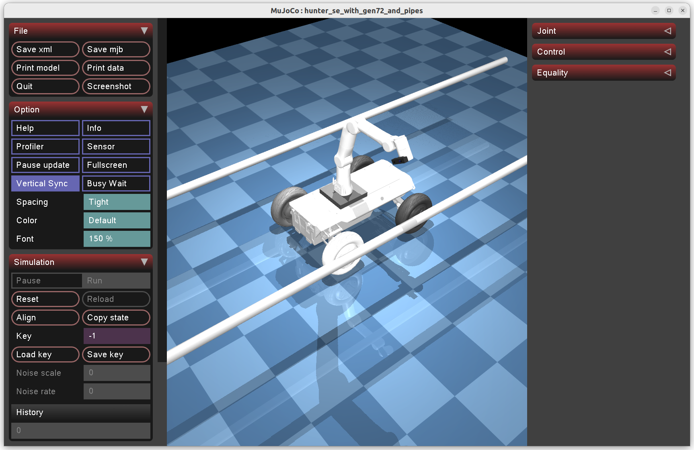

# dora-moveit2

A reusable robot motion planning library for the [dora-rs](https://github.com/dora-rs/dora) dataflow framework. Provides MoveIt-style IK solving, collision-aware OMPL planning, trajectory execution, and a high-level MoveGroup API — for any robot arm.



## Features

- **MoveGroup API** — High-level interface similar to ROS MoveIt's MoveGroupCommander
- **IK Solver** — TracIK-inspired multi-start inverse kinematics
- **Motion Planner** — RRT-Connect (OMPL) with geometric collision detection
- **Planning Scene** — Obstacle management and scene state broadcasting
- **Trajectory Executor** — Quintic spline interpolation with smooth execution
- **Robot-agnostic** — Bring your own robot config via `ROBOT_CONFIG_MODULE` env var

## Quick Start

```bash
# Install the library
pip install -e dora_moveit/

# Install an example app
pip install -e examples/move_group_demo/

# Run the ROS MoveIt-style example (GEN72 arm in MuJoCo)
cd examples/move_group_demo
dora up
dora start dataflows/moveit_example_mujoco.yml
```

## Examples

| Example | Robot | Description |
|---------|-------|-------------|
| [move_group_demo](examples/move_group_demo/) | GEN72 7-DOF | ROS MoveIt-style API demo — named poses, joint goals, Cartesian paths, collision objects |
| [hunter_with_arm](examples/hunter_with_arm/) | Hunter SE + GEN72 | Mobile robot with arm for multi-view inspection |

See the [examples README](examples/README.md) for details and a guide to creating your own.

## Repository Structure

```
dora_moveit/           # Library package (pip install -e dora_moveit/)
  dora_moveit/
    config.py          # RobotConfig protocol + load_config()
    ik_solver/         # IK solver operators
    motion_planner/    # OMPL planner + planning scene
    trajectory_execution/  # Trajectory executor
    collision_detection/   # Collision checking
    workflow/          # MoveGroup API + motion commander
examples/              # Example applications
  move_group_demo/     # ROS MoveIt-style MoveGroup API example
  hunter_with_arm/     # Hunter SE mobile robot + GEN72 7-DOF arm
dora-mujoco/           # MuJoCo simulation node
```

## Usage

### MoveGroup API (ROS MoveIt equivalent)

```python
from dora_moveit.workflow.move_group import MoveGroup

group = MoveGroup("gen72")
scene = group.get_planning_scene_interface()

# 1. Named pose
group.set_named_target("home")
group.go(wait=True)

# 2. Joint-space goal
group.go([1.57, -0.785, 0.0, -1.57, 0.0, 0.785, 0.0], wait=True)

# 3. Cartesian pose goal (IK solved internally)
group.set_pose_target([0.15, 0.1, 0.6, 0, 0, 0])
group.go(wait=True)

# 4. Cartesian path (straight line in workspace)
waypoints = [[0.15, 0.1, 0.5, 0, 0, 0], [0.15, 0.2, 0.5, 0, 0, 0]]
trajectory, fraction = group.compute_cartesian_path(waypoints, eef_step=0.01)
group.execute(trajectory, wait=True)

# 5. Collision objects
scene.add_box("obstacle", [0.4, 0.0, 0.5], [0.1, 0.1, 0.5])
group.set_named_target("home")
group.go(wait=True)  # planner avoids the box
scene.remove_world_object("obstacle")

group.shutdown()
```

### Robot Config Injection

Library operators are robot-agnostic. Define a config class for your robot:

```python
# my_app/config/my_robot.py
import numpy as np

class MyRobotConfig:
    NUM_JOINTS = 6
    JOINT_LOWER_LIMITS = np.array([...])
    JOINT_UPPER_LIMITS = np.array([...])
    LINK_TRANSFORMS = [...]
    COLLISION_GEOMETRY = [...]
    HOME_CONFIG = np.array([...])
    SAFE_CONFIG = np.array([...])
    NAMED_POSES = {"home": np.array([...])}
```

Set the env var in your dataflow YAML:

```yaml
- id: planner
  path: ../my_app/nodes/planner.py
  env:
    ROBOT_CONFIG_MODULE: "my_app.config.my_robot"
```

See [`dora_moveit/dora_moveit/config.py`](dora_moveit/dora_moveit/config.py) for the full `RobotConfig` protocol and [`examples/`](examples/) for a complete working example.

## Deployment Guide — MuJoCo Demos

### Prerequisites

- Python 3.9+
- [dora-rs](https://github.com/dora-rs/dora) CLI installed (`cargo install dora-cli` or download a release binary)
- A display server (X11/Wayland) for the MuJoCo viewer

### 1. MoveGroup Demo (GEN72 Standalone Arm)

The simplest starting point — a single GEN72 7-DOF arm demonstrating all 5 MoveGroup features: named poses, joint goals, Cartesian pose goals, Cartesian paths, and collision objects.

```bash
# 1. Install packages
pip install -e dora_moveit/
pip install -e dora-mujoco/
pip install -e examples/move_group_demo/

# 2. Launch
cd examples/move_group_demo
dora up
dora start dataflows/moveit_example_mujoco.yml

# 3. Stop when done
dora stop
```

**Dataflow nodes:** `mujoco_sim` → `planning_scene` → `planner` → `ik_solver` → `trajectory_executor` → `user_node`

The `user_node` runs through all 5 demos automatically and then idles. The MuJoCo viewer window shows the arm moving in real time.

**Troubleshooting:**
- If nodes fail with `ModuleNotFoundError`, ensure all three packages are installed in the same Python environment that dora uses. You can set `PYTHONPATH` in each node's `env:` block in the dataflow YAML to point to your site-packages directory.
- If you see `version mismatch: message format vX is not compatible with vY`, make sure the `dora-rs` Python package version matches your `dora` CLI version (`dora --version`).

### 2. Hunter with ARM Demo (Mobile Robot + Arm)

Hunter SE mobile platform with a GEN72 arm mounted on top, operating in an industrial pipe inspection scene.

```bash
# 1. Install packages
pip install -e dora_moveit/
pip install -e dora-mujoco/
pip install -e examples/hunter_with_arm/

# 2. Launch MoveGroup API demo
cd examples/hunter_with_arm
dora up
dora start dataflows/movegroup_mujoco.yml

# 3. Stop when done
dora stop
```

**Available dataflows:**

| Dataflow | Description |
|----------|-------------|
| `movegroup_mujoco.yml` | MoveGroup API demo — arm moves through named poses, joint goals, and planned trajectories |
| `hunter_arm_mujoco.yml` | Choreographed multi-view capture — arm sequences through inspection positions |
| `gen72_mujoco.yml` | Standalone GEN72 arm simulation (no Hunter SE vehicle) |
| `gen72_real.yml` | Physical GEN72 arm via Realman SDK (requires hardware) |

**Dataflow nodes (movegroup):** `mujoco_sim` → `planning_scene` → `planner` → `ik_solver` → `trajectory_executor` → `vehicle_controller` → `user_node`

The demo automatically:
1. Moves the arm to home position
2. Turns the arm right
3. Arches over a pipe (capture position)
4. Returns to home
5. Executes a planned trajectory
6. Idles when complete

**Troubleshooting:**
- Verify the `MODEL_NAME` path in the dataflow YAML points to the correct `.xml` file under `examples/hunter_with_arm/models/`.
- The Hunter SE model (`hunter_se_with_arm_and_pipes.xml`) includes the vehicle, arm, and industrial pipe scene. If you only want the arm, use `gen72_mujoco.yml` instead.

### Environment Variable Setup (Alternative to pip install)

If you prefer not to use pip editable installs, set `PYTHONPATH` directly:

```bash
export PYTHONPATH=/path/to/dora_moveit:/path/to/dora-mujoco:/path/to/examples/hunter_with_arm:$PYTHONPATH
```

Or add `PYTHONPATH` to each node's `env:` block in the dataflow YAML:

```yaml
env:
  ROBOT_CONFIG_MODULE: "hunter_arm_demo.config.gen72"
  PYTHONPATH: "/path/to/your/site-packages"
```

## Adding a New Robot

See the [examples README](examples/README.md) for a step-by-step guide to creating a new example application with your own robot.

## License

MIT
